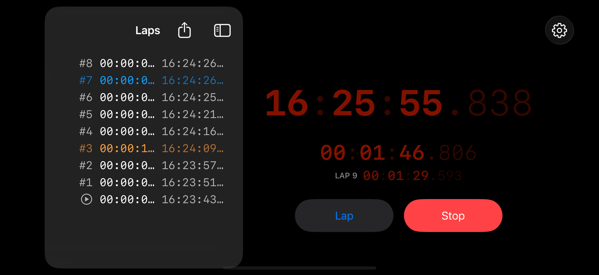
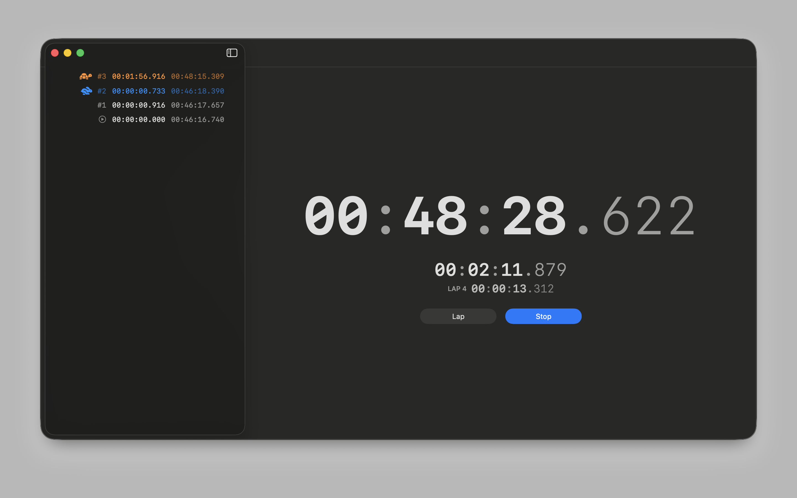
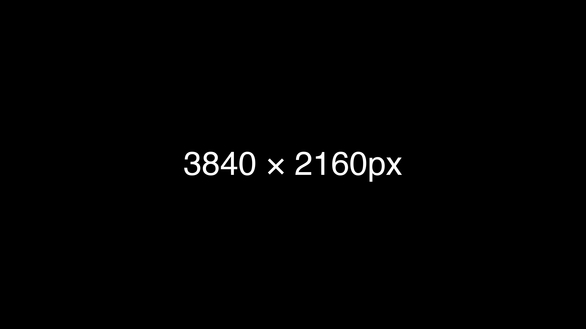

# LiveClock - The Gig Timer

[](https://apps.apple.com/app/liveclock-the-gig-timer/id6752553093)

A professional-grade timer application designed for stage performances, presentations, and live events. LiveClock provides precise timing control with an intuitive interface optimized for visibility and ease of use during performances.

## 🎯 Features

### Core Functionality
- **Precision Timing**: Millisecond-accurate stopwatch engine
- **Lap Recording**: Track multiple segments within your performance
- **Time Format**: Clear `HH:MM:SS.mmm` display format
- **Universal Platform Support**: Native apps for iOS, iPadOS, macOS, and visionOS

### User Interface
- **Adaptive Layouts**: Single and two-column views optimized for different screen sizes
- **High Visibility**: Large, clear time display readable from a distance
- **Theme Options**: System, Light, and Dark modes
- **Customizable Colors**: Choose your preferred text colors for optimal visibility

### Performance Features
- **Keep Awake**: Prevents screen from sleeping during active timing
- **Display-Linked Updates**: Smooth 60fps/120fps time updates on iOS/visionOS
- **Low Power Consumption**: Optimized for extended use during long events

## 📱 Platform Support

| Platform | Minimum Version | Features |
|----------|----------------|----------|
| iOS | 17.0+ | Full feature set with display-linked updates |
| iPadOS | 17.0+ | Optimized for larger screens with multi-column layout |
| macOS | 14.0+ | Native Mac app with keyboard shortcuts |
| visionOS | 1.0+ | Spatial computing support with immersive timing |

## 🛠️ Development

### Prerequisites
- Xcode 15.0 or later
- macOS Sonoma 14.0 or later
- [Tuist](https://tuist.io) (recommended) or Swift Package Manager

### Building the Project

#### Option A: Using Tuist (Recommended)
```bash
# Generate Xcode project
tuist generate

# Open the workspace
open LiveClock.xcworkspace
```

#### Option B: Using Swift Package Manager
1. Open `Package.swift` in Xcode
2. Follow the instructions in `PROJECT_SETUP.md` to configure the app target
3. Add dependencies to Core, Platform, and UI package products

### Project Structure
```
LiveClock/
├── Sources/
│   ├── App/           # Main app entry points
│   ├── Core/          # Business logic and models
│   ├── Platform/      # Platform-specific implementations
│   └── UI/            # SwiftUI views and components
├── Resources/         # Assets and configurations
├── docs/              # Architecture and design documentation
└── Tests/             # Unit and UI tests
```

## 📖 Documentation

Comprehensive documentation is available in the `docs/` directory:
- [`docs/README.md`](docs/README.md) - Documentation index
- [`docs/overview.md`](docs/overview.md) - Product overview and use cases
- [`docs/architecture.md`](docs/architecture.md) - Technical architecture
- [`docs/coding-standards.md`](docs/coding-standards.md) - Code style guidelines

## 🤝 Contributing

We welcome contributions! Please see our [Contributing Guidelines](CONTRIBUTING.md) for details on:
- Code of conduct
- Development workflow
- Pull request process
- Coding standards

## 🔧 Configuration

### App Settings
- **Bundle ID**: `io.ngs.LiveClock`
- **Display Name**: LiveClock The Gig Timer
- **Team ID**: Configured via Tuist environment

### Build Configurations
- **Debug**: Development builds with debugging enabled
- **Release**: Production builds with optimizations
- **CI**: Automated testing configuration

## 🚀 Deployment

### App Store Release
The app is available on the [App Store](https://apps.apple.com/app/liveclock-the-gig-timer/id6752553093).

### TestFlight Beta
Beta versions are distributed through TestFlight. Contact the development team for access.

## 📱 Screenshots

<div align="center">
  
  
  
  
</div>

## 🔒 Privacy

LiveClock respects your privacy:
- No data collection
- No analytics tracking
- No network requests
- All timing data stays on your device

## 📄 License

Copyright © 2024 Atsushi Nagase. All rights reserved.

## 🙏 Acknowledgments

Special thanks to all contributors and beta testers who helped make LiveClock better.

---

<div align="center">
  <strong>Built with ❤️ for performers worldwide</strong>
  <br>
  <a href="https://liveclock.ngs.io">liveclock.ngs.io</a>
</div>